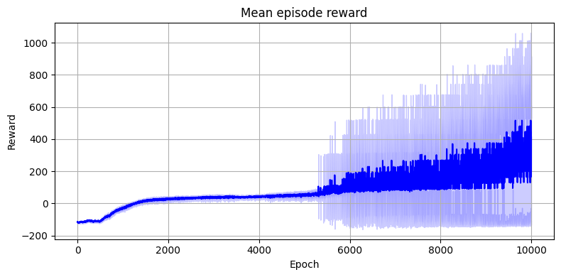
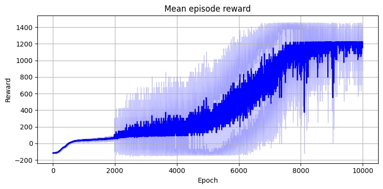
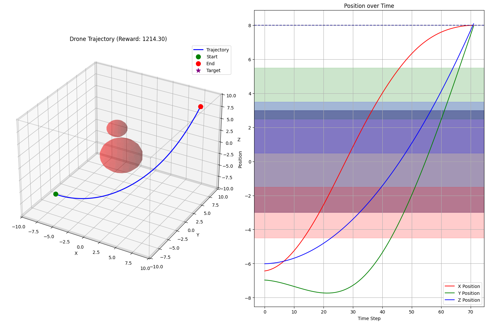

# REINFORCE for 3D drone control

## Project overview

In this project we implement REINFORCE (policy gradient) algorithm to control the drone in 3D environment. The goal of the agent is to go from random start position to target position, while avoiding obstacles. We use continuous state and action spaces to make the problem more challenging.

## Environment

The environment is a 3D cube with bounds. The drone and `k` obstacles are represented by spheres with certain radius to simplify collision detection. The drone is controlled by acceleration in `x`, `y`, `z` directions, and there is a global gravity force acting on the drone in `-z` direction.

In our setup, target position, obstacle positions, obstacle radii and world bounds are fixed. Drone start position is sampled from a uniform distribution over a volume inside the world bounds. We create an obstacle in the middle of the world for the agent to navigate around it.

Our implementation uses JAX, and utilizes some methods and approaches from Brax simulator. This allows us to use JIT compilation and vectorization to speed up the training process and perform more training steps faster.

### Observation space

Observation is made of `2 + k` flattened vectors:

- Current velocity of the drone
- Distance to the target
- Distances to `k` obstacles

We observed that inclusion of position-dependent information (like position of the drone or distances to world bounds) does not improve the performance of the agent.

### Action space

Action space is continuous and consists of 3 components - acceleration in `x`, `y`, `z` directions. Actions are sampled from normal tanh distribution (to properly constrain them to `[-1, 1]` range) and multiplied by `max_acceleration` to scale them to the desired range.

### Rewards

Reward function is a sum of the following terms:

- `target_reward` - `1000` if the drone is within `target_threshold` distance to the target, `0` otherwise
- `collision_reward` - `-100` if the drone is in collision with an obstacle, `0` otherwise
- `oob_reward` - `-100` if the drone is outside the world bounds, `0` otherwise
- `distance_reward = 10 * movement_distance`, proportional to the distance the drone moved
- `time_reward = -10 * dt`, negative proportional to the time step

## Algorithm

We use a standard REINFORCE algorithm with(out) baseline. In each epoch, we do the following:

1. Generate an episode (unroll)

$$
(s_0, a_0, r_0), (s_1, a_1, r_1), \ldots, (s_{T-1}, a_{T-1}, r_{T-1}),
$$
following the policy $\pi_{\theta}(\cdot|s)$. $T$ is the maximum number of steps in an episode.

2. Compute the return (reward-to-go):

$$
G_t = \sum_{k=t}^{T-1} \gamma^{k-t} r_k
$$
where $\gamma$ is the discount factor.

3. Compute the advantage:

$$
A_t = G_t - B_t
$$
where $B_t$ is the baseline (if used). Then, normalize the advantages:

$$
\hat{A}_t = \frac{A_t - \mu_{A_t}}{\sigma_{A_t}}
$$

4. Update the policy parameters:

$$
\theta \leftarrow \theta + \alpha \sum_{t=0}^{T-1} \nabla_\theta \log \pi_{\theta}(a_t|s_t) \hat{A}_t
$$

5. Update the baseline (if used):

$$
B_t \leftarrow \beta B_t + (1 - \beta) G_t
$$

The difference from the standard REINFORCE algorithm is that we use batch of episodes in each epoch. We also use a baseline for each step in the unroll, instead of a single value, so $B_t$ is a vector of the same length as the unroll.

For this approach to work with jax, when performing the unroll, we do not stop environment when terminal state is reached. Instead, we effectively mask out the rewards after the terminal state.

## Installation

We use `conda` to create a new environment and install the necessary packages.

Use

```bash
conda env create -f environment.yml
```

for a CPU jax installation, or

```bash
conda env create -f environment_cuda.yml
```

for a GPU jax installation.

For training and evaluations, see `train.ipynb` notebook.

## Hyperparameters

We used the following hyperparameters:

- `dt = 0.05`
- `num_epochs = 10000`
- `unroll_length = 150`
- `batch_size = 32`
- `learning_rate = 1e-5`
- `discount_factor = 0.99`
- `baseline_decay = 0.95`
- MLP architecture: `(128, 128, 128, 128)`

So, in total, we perform `10000` gradient steps and `48.000.000` environment steps.

## Results

Below are the results of the training process. In light blue we show the variance of the rewards (averaged over batch dimension).

Rewards without baseline:



Rewards with baseline:



We can see that with baseline, the training process is faster. Probably, without baseline we may achieve similar results, but it would take more epochs to converge.

> With defined hyperparameters parameters, the agent is able to reach the target in under `100` steps, in 100% of cases, assuming limitations of static obstacles, static target and low-variable start position.
> However, without baseline, the agent reaches the target in around 50% of cases.

Trajectory of the agent when trained with baseline:



## Discussion

### Environment design

During the development and evaluation, we observed that the hardest and most important part of the implementation is the design of the reward function (since we implemented it ourselves). For example, changing the order of negative rewards for collisions may lead to the agent learning suboptimal strategies, where it prefers to collide with obstacles than to reach the target, if number of training steps is not enough.

### Evaluation

Some general observations during evaluations:

- Increasing the batch size in general decreases the variance of the mean reward per epoch.
- With some parameters, it is possible to train the agent to go over more complex trajectories, but it is not stable, requires careful tuning of the reward function, and suboptimal with the presented simplistic environment.
- Choice of learning rate is important. For example, `1e-4` learning rate leads to unstable training, where agent is able to reach the target, but at some epochs it gets stuck in suboptimal strategies.
- We did not exaustively explore the required number of layers in the network, but we observed that `4` layers are sufficient for this task, and `2` layers are not enough.

## Future work

We consider the following improvements for future work:

- Modeling the drone as a "box", with orientation control.
- Implementing a more sophisticated reward function that can better guide the agent to reach the target while avoiding obstacles.
- Adding a more complex environment with dynamic obstacles or changing target positions.
- Using more advanced reinforcement learning algorithms.
